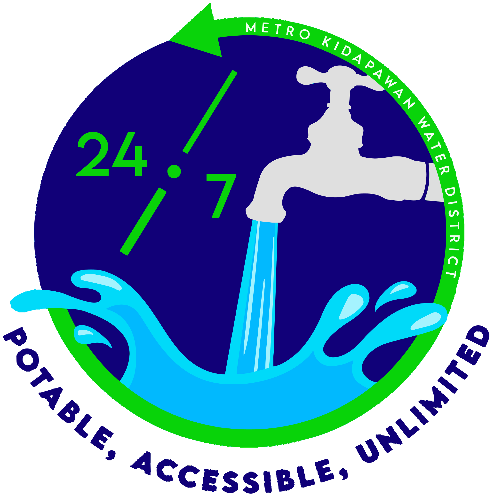

# MKWD HRIS - Project Setup Guide

Welcome to the **MKWD (Metro Kidapawan Water District) HRIS** project.

This README contains the essential steps for local development setup, including default seeded user credentials for testing.

<p align="center">
  
</p>

---

## Default Development Users (Seeded Roles)

For development and testing, these users are seeded after `php artisan migrate:fresh --seed`.

> **These accounts are for local development only.**
> Do NOT use these credentials in production.

### Credentials by Role

- `super_admin`
  - Email: `superadmin@gmail.com`
  - Password: `password`
- `hr_admin`
  - Email: `anessa.orales20@obx.gov.ph`
  - Password: `password`
- `ogm`
  - Email: `usan.una28@obx.gov.ph`
  - Password: `password`
- `document_tracking_operator` (one per department)
  - `anessa.orales20@obx.gov.ph`
  - `onald.acapagal24@obx.gov.ph`
  - `usan.una28@obx.gov.ph`
  - Password (all): `password`

---

## Local Setup

After cloning the repository, run the following commands:

```bash
composer install
npm install
cp .env.example .env
php artisan key:generate
php artisan migrate:fresh --seed
composer run dev
```
